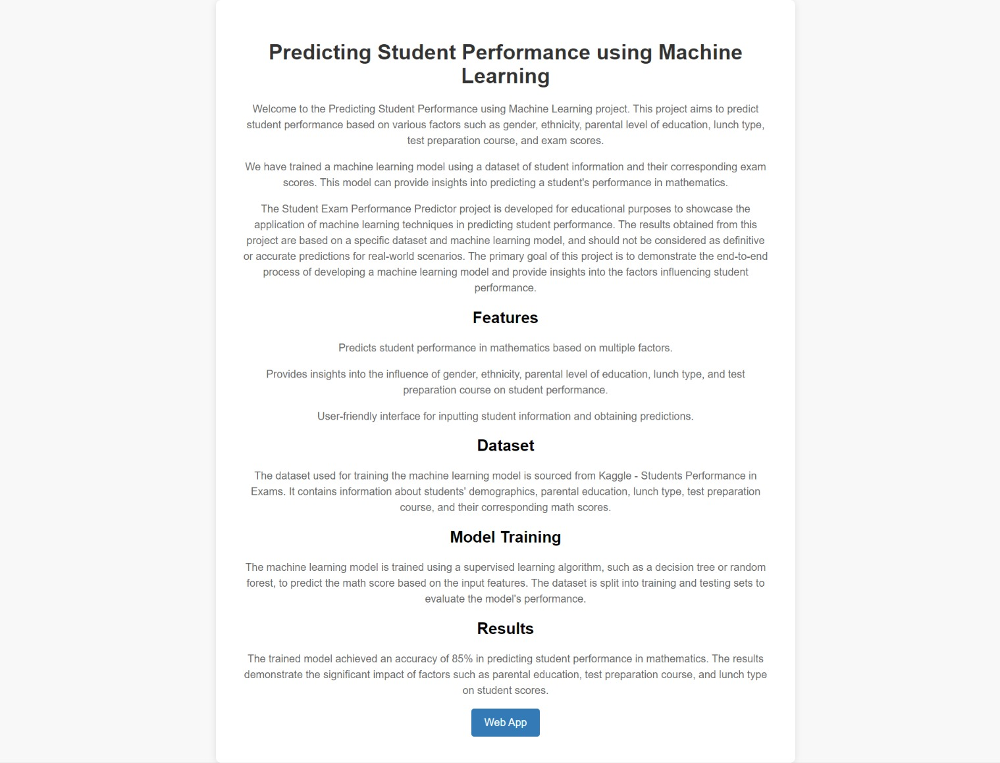
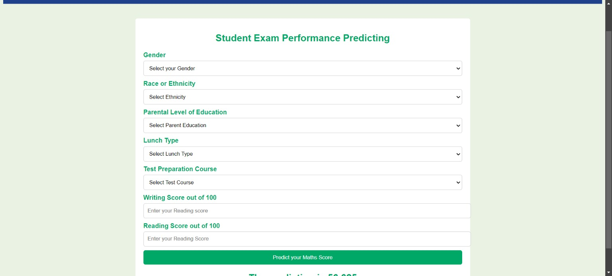

# Predicting-Student-Performance-Using-Machine-Learning

In today's educational landscape, understanding the factors that contribute to a student's academic performance is crucial for educators, parents, and policymakers. This project leverages machine learning techniques to predict a student's performance in mathematics based on various factors. By providing accurate predictions, this tool can help identify students who may need additional support and tailor educational strategies accordingly.

Note: This Project is for Educational Purposes Only

The Student Exam Performance Predictor project is developed for educational purposes to showcase the application of machine learning techniques in predicting student performance. The results obtained from this project are based on a specific dataset and machine learning model, and should not be considered as definitive or accurate predictions for real-world scenarios. The primary goal of this project is to demonstrate the end-to-end process of developing a machine learning model and provide insights into the factors influencing student performance.

This project aims to predict student performance based on various factors such as gender, ethnicity, parental level of education, lunch type, test preparation course, and exam scores. The machine learning model trained on a dataset of student information can provide insights into predicting a student's performance in mathematics.

Features
Predicts student performance in mathematics based on multiple factors.
Provides insights into the influence of gender, ethnicity, parental level of education, lunch type, and test preparation course on student performance.
User-friendly interface for inputting student information and obtaining predictions.

Dataset

The dataset used for training the machine learning model is sourced from Kaggle - Students Performance in Exams. It contains information about students' demographics, parental education, lunch type, test preparation course, and their corresponding math scores.

Model Training

The machine learning model is trained using a supervised learning algorithm, such as a decision tree or random forest, to predict the math score based on the input features. The dataset is split into training and testing sets to evaluate the model's performance.

Technology Used
Python
Machine Learning
Pandas
Numpy
Scikit-learn
Flask
HTML
CSS
Installation Step : -
Python version > greater than 3.7.0
command 1 - python -m pip install –-user -r requirements.txt
command 2 - python app.py

# Result Screenshot

